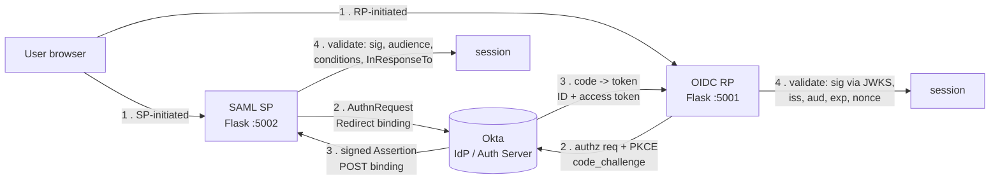

# okta-federation-lab

Two self-contained apps I built to federate to Okta — one via SAML 2.0, one via OIDC
with PKCE — plus the decoded-token deep dives and troubleshooting notes that prove I
understand what's crossing the wire, not just which buttons to click in the admin
console.

**Proof:** offline validation self-tests (19 checks across both protocols) in
[`evidence/local-runs/`](evidence/local-runs/). Both apps run against a real Okta
Developer org via the [execution guide](docs/EXECUTION-GUIDE.md).

## The business problem

"Integrate this app with our SSO" is one of the most common tickets an IAM analyst
gets, and it splits two ways: the vendor speaks SAML, or the vendor speaks OIDC. Doing
it safely means knowing what a valid assertion or token actually contains, which fields
you must validate, and how to read the failure when it breaks — because it will break,
usually on a clock, a certificate, or a mismatched URL. This lab is both halves,
built as real relying-party apps rather than screenshots of a wizard, so the security
logic is visible and testable.

## Architecture

Both apps are SP/RP-initiated: build the request, hand off to Okta, receive the signed
response on the callback, and — the part that matters — validate it before trusting a
single claim.

## What I built

**A SAML 2.0 Service Provider** ([`src/saml-sp/`](src/saml-sp/)): builds and DEFLATE-
encodes an AuthnRequest (Redirect binding), consumes the POSTed Response, and validates
the assertion — status, audience, `Conditions` window with clock-skew tolerance,
`Recipient`, and `InResponseTo` — failing *closed* on any signature it can't verify.
Serves its own SP metadata for pasting into Okta.

**An OIDC Relying Party** ([`src/oidc-rp/`](src/oidc-rp/)): full Authorization Code flow
**with PKCE** (S256), validating the ID token by fetching Okta's JWKS, matching the
signing key by `kid`, and checking signature, `iss`, `aud`, `exp`, and `nonce`. Works as
a public client with no secret, which is the modern default.

I kept both dependency-light on purpose so the security steps are readable rather than
hidden in an SDK — with one honest exception: XML-DSig verification with canonicalization
is a genuine security minefield, so the SAML app defers real signature crypto to
`signxml`/xmlsec and fails closed without it (explained in the app and troubleshooting
doc). The *claim-validation logic* is hand-written and unit-tested offline.

The documentation is the point as much as the code:
[annotated SAML assertion](docs/ANNOTATED-SAML-ASSERTION.md) (every element, what it
means, why I check it), [annotated OIDC tokens](docs/ANNOTATED-TOKENS-OIDC.md) (ID vs
access token, claim by claim), [SAML vs OIDC](docs/SAML-VS-OIDC.md) in plain analyst
language, and [six federation failures](docs/TROUBLESHOOTING.md) as symptom → diagnosis
→ fix.

## Evidence

- [`evidence/local-runs/federation-selftests.png`](evidence/local-runs/federation-selftests.png)
  — both apps' offline self-tests: PKCE correctness, ID-token validation (aud/exp/nonce/
  issuer/tamper all rejected), SAML assertion validation (unsigned/audience/recipient/
  InResponseTo/expiry/status all rejected)
- Live-Okta screenshots (SAML tracer capture, decoded ID token, both `/profile` pages)
  land in `evidence/` per the [capture checklist](evidence/CAPTURE-CHECKLIST.md)

## How to reproduce

[docs/EXECUTION-GUIDE.md](docs/EXECUTION-GUIDE.md) — offline self-tests need only Python;
live mode needs a free Okta Developer Edition org (~20 min for both apps).

## What I learned / what I'd do differently in production

Writing the validators taught me that the security of federation lives almost entirely
in the *relying party's checks*, not the protocol. SAML and OIDC both hand you a signed
blob; every real-world break I documented is either a skipped validation or a
mismatched string. Building the SAML validator also gave me real respect for why you
don't hand-roll XML signature verification — canonicalization and signature-wrapping are
exactly the kind of thing that looks fine in a demo and is exploitable in production.

In production I'd use battle-tested libraries end to end (python3-saml, a mature OIDC
middleware), add proper session hardening (secure/SameSite cookies, CSRF beyond the
`state` check, short server-side sessions), implement Single Logout for SAML and
back-channel logout for OIDC, and centralize the IdP cert/JWKS handling so rotation is
automatic rather than a scheduled outage. The apps here are teaching instruments tuned
to make the protocol legible; the production version trades that legibility for
libraries that have survived years of adversarial review.

## Related concepts

`SAML 2.0` · `OIDC / OpenID Connect` · `OAuth 2.0` · `PKCE` · `JWT / JWKS validation`
· `SSO integration` · `assertion & token validation` · `federation troubleshooting`
